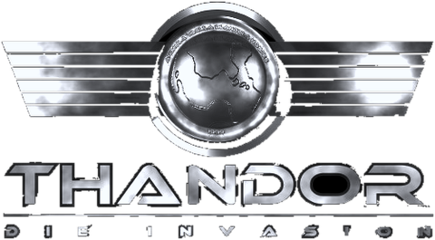
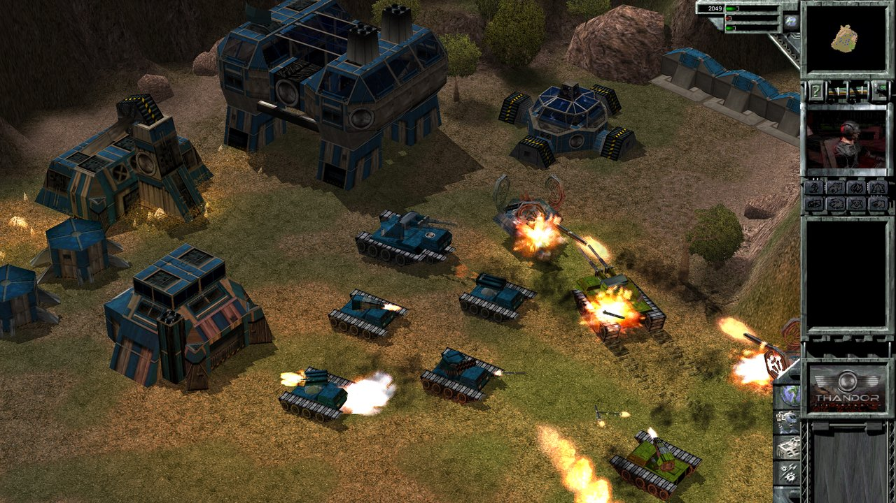
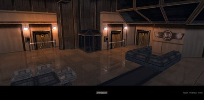
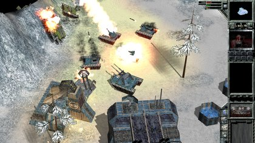
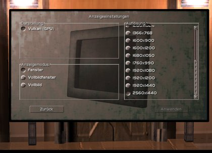
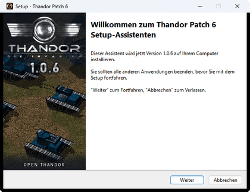
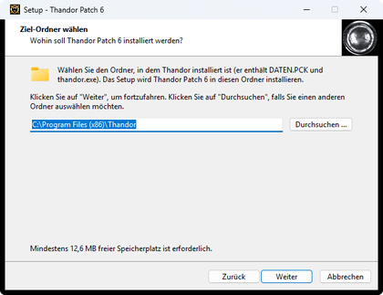
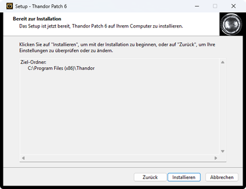

<p align="center">
  
</p>

<h1 align="center">Open Thandor</h1>

<p align="center">
  <b>A complete C++ re-implementation of the 3D real-time strategy game <i>Thandor: The Invasion</i> (2000) -<br>
  native 64-bit on Windows 10/11, Vulkan or DirectX 12, up to 4K, original gameplay.</b>
</p>

<p align="center">
  <a href="https://discord.gg/FEvKJ59"></a>
  <a href="LICENSE"></a>
</p>

<p align="center">
  
</p>

<p align="center">
  
  
  
</p>

> **You need the original game.** Open Thandor contains no game data: it runs on the data of an installed full
> version of Thandor (the folder with `DATEN.PCK`). Community: [thandor.cc](https://thandor.cc) and its
> [Discord](https://discord.gg/FEvKJ59).

*Deutsch: Open Thandor ist ein vollständiger Nachbau von "Thandor: Die Invasion" in C++. Der Patch-Installer
`Thandor-Patch-6.exe` macht eine vorhandene Thandor-Installation zu Open Thandor 1.0.6 - 64 Bit, Vulkan/DirectX 12,
Auflösungen bis 4K, UI-Skalierung und viele Absturzkorrekturen. Spielstände und Karten des Originals funktionieren
weiter. Details: [Patch notes](docs/PATCH_NOTES.md#deutsch).*

## Install and play

You need an **installed full version of Thandor** and **64-bit Windows 10 or 11**.

1. Download **`Thandor-Patch-6.exe`** from the [latest release](https://github.com/idkFoxes/open-thandor/releases/latest).
2. Run it. It finds your Thandor folder (the one with `DATEN.PCK`); Patch 5 is not required.
3. Start the game as before with `thandor.exe` in the game folder.

<details>
<summary>Installer screenshots and notes</summary>
<br>




- The installer keeps your old `thandor.exe` as `thandor-1.05.exe`. Uninstalling ("Apps" in Windows, entry
  "Thandor Patch 6") puts it back.
- Your saves, your settings and the game data (`*.PCK`, movies) are never changed. Saves of the original game load,
  and the game still writes saves in the original format.
- The installer is not signed, so Windows SmartScreen may warn ("More info" -> "Run anyway").
- The settings are in `thandor.ini` next to the game; your old `thandor.dat` settings are taken over once.

</details>

## What's new compared with Thandor 1.05

| | Thandor 1.05 (original) | Open Thandor 1.0.6 |
|---|---|---|
| Program | 32-bit, 1999 Windows APIs | native 64-bit, C++20 on SDL3 |
| Graphics | DirectDraw, Glide (3dfx), Direct3D | **Vulkan**, **DirectX 12** or the software renderer, switched in the menu |
| Resolution | only the ten smallest display modes listed | **every mode of your display up to 4K**, window / borderless / fullscreen |
| UI on large screens | tiny | **UI scaling** Auto, 1x, 2x, 3x (crisp, 3D view at full resolution) |
| Frame pacing | - | **VSync** and an optional frame limit (60, 120, 144) |
| Sound, music, movies | DirectSound, WinMM | SDL3, works on current Windows |
| Settings | binary `thandor.dat` | readable `thandor.ini` (old settings taken over) |
| Damaged files, odd maps | crashes | rejected with a message; safe saving |
| Rules, AI, saves, maps, LAN | - | **unchanged**: saves, levels and multiplayer stay compatible with the original |

Full list: **[Patch notes](docs/PATCH_NOTES.md)**.

### What works

| Area | Status |
|---|---|
| Single player: menus, campaigns, skirmish, AI, save/load, movies, sound | playable. An automated run starts all 56 missions: 50 play without problems, 1 level file is missing from the original data, and the 5 levels that need the units carried over from the previous level play when reached through that level. A campaign run wins every level in turn and reaches the end of all four campaigns (tutorial, Luke, Nimm2, Hansolo) |
| Graphics | Vulkan (default), DirectX 12 or software; window, borderless or exclusive fullscreen ([details](docs/BUILDING.md#renderer-and-display-mode-display-settings)). The original's Glide (3dfx) and Direct3D renderers were removed |
| Multiplayer (LAN, UDP) | works in a local two-instance test: lobby, map and faction choice, briefing, in-game commands; protocol-compatible with the original game |
| Map editor | hidden in the original; opened by a hotkey on the `experimental/map-editor` branch |

## For developers

### Current state

**All of `thandor.exe` is reimplemented in readable C++ (C++20), as a 64-bit program on SDL3.** No original machine
code is executed and the original executable is not needed. Its data (tables, UI templates, strings) is compiled in
as ordinary variables of the modules; only the game's data files (`*.PCK`, movies) come from an installation.

- 1,919 original functions in about 160,000 lines (198 source files, 52 modules).
- Every function has a header comment (what it does, who calls it); names, constants and structure types are
  readable throughout, control flow is structured.
- The code no longer refers to the original binary: the original addresses of all functions and data are kept in
  one list, [docs/original_addresses.txt](docs/original_addresses.txt), for comparisons with the original.
- Bugs and quirks of the original game are kept on purpose and marked "Original quirk" in the code; only the ones
  that corrupt memory or crash are bounded.

### Roadmap

1. Step 8 (done): a full code review and idiomatic C++, following the
   [C++ Core Guidelines](https://isocpp.github.io/CppCoreGuidelines/CppCoreGuidelines) ([plan](docs/plans/step8_idiomatic_cpp.md)).
2. Step 9 (done): the UI and the 2D overlays drawn on the GPU, UI scaling at 1440p and 4K
   ([plan](docs/plans/step9_gpu_ui.md)).
3. Step 10 (done): the patch installer "Thandor Patch 6" (Inno Setup 7) for version 1.0.6, built by GitHub Actions
   on a release tag ([plan](docs/plans/step10_installer.md)).
4. Step 11 (done): security and crash fixes for local input - level, savegame and asset files, local crashes,
   thread races, undefined behaviour ([plan](docs/plans/step11_security_crash.md)).
5. Step 12 (next): the multiplayer security fixes - data received from peers, lobby and session transfer, the
   UDP backend; tested against the original game ([plan](docs/plans/step12_multiplayer_security.md)).
6. Step 13 (done): modern C++ - typed UI objects instead of template offsets, named casts, `constexpr` and
   `enum class`, RAII, `bool`, named key actions and plain loops ([plan](docs/plans/step13_modern_cpp.md)).

### How correctness is kept

The project gave up byte-identical machine code in favour of readable code; behaviour is checked instead
([`tools/test/run_checks.py`](tools/test/run_checks.py), run after every change):

- **Determinism**: scripted battles with a fixed random seed write a hash of the game state every simulation step;
  every build must produce the same hash sequence as the reference.
- **AI hash, pixels, save/load, text editing**: AI decisions per step, screenshots of fixed scenes, a saved and
  reloaded game, the in-game text editor.
- **Multiplayer**: two instances play a game against each other over UDP.
- **Campaign and all missions**: the campaign chain with carried-over units and a start of every mission
  ([`run_all_maps.py`](tools/test/run_all_maps.py), [`run_campaign_chain.py`](tools/test/run_campaign_chain.py)).
- **GPU renderers**: Vulkan and DirectX 12 compared with the software renderer
  ([`gpu_compare.py`](tools/test/gpu_compare.py)).
- **Self-tests** for the number formatting, fixed-point math, key mapping, triangle setup, the archive codec, the
  movie encoder and more compare their output between builds.

### Building

The main compiler is MinGW-w64 GCC (x86_64, SEH; tested with GCC 15.2): CMake 3.25+, Ninja, `g++` on the `PATH` or
`MINGW_ROOT` set ([`cmake/mingw-x64.cmake`](cmake/mingw-x64.cmake)), SDL3 with Vulkan from
`vcpkg install sdl3[vulkan]:x64-mingw-dynamic`, and dxc for the Vulkan shaders, `vcpkg install directx-dxc:x64-windows`.
CMake finds them through the environment variable `VCPKG_ROOT` (the vcpkg directory).

```bat
set PATH=C:\mingw64\bin;%PATH%
set VCPKG_ROOT=C:\path\to\vcpkg
cmake --preset mingw-release
cmake --build --preset mingw-release
```

The result is `build-mingw-release\thandor.exe` (x64) with `SDL3.dll` next to it; copy both into a **copy** of an
installed Thandor folder and start it there (e.g. `thandor.exe -NOINTRO`). `--target installer` builds
`Thandor-Patch-6.exe` (needs Inno Setup 7, see [docs/BUILDING.md](docs/BUILDING.md#patch-installer)).
`mingw-test` (`build-mingw-test`) adds the developer tools: self-tests, windowed mode, several instances, scripted
input, starting any campaign level, the determinism state hash; the automated checks use this build.

MSVC (Visual Studio 2022 or newer, SDL3 from `vcpkg install sdl3[vulkan]:x64-windows`) is the second compiler, kept
building for the Visual Studio debugger (presets `release`, `debug`, `test`, `gpu-test` in
[`CMakePresets.json`](CMakePresets.json)). Details in [docs/BUILDING.md](docs/BUILDING.md).

### Source tree

Public headers under [`include/thandor`](include/thandor), implementations under [`src`](src), grouped by area
(`assets`, `audio`, `core`, `gameplay`, `graphics`, `movie`, `network`, `platform`, `ui`, `world`).

- [Module tree](docs/MODULE_TREE.md) - every module with its `.cpp` and `.h` files.
- [Source file guide](docs/SOURCE_FILE_GUIDE.md) - what each source/header pair owns, its callers and dependencies.
- Types: each module's structures are in `include/thandor/<area>/<module>/types.h`, the common ones in [core/types.h](include/thandor/core/types.h).
- File formats: [levels](docs/level_format.md), [field grids](docs/field_grid_format.md).

## About

Got this game back then and can't forget it, so this project rebuilds it in C++ to fix things, replace the AI,
change the graphics API, fix sound and so on. I hope some of you want to join this effort too - come by on
[thandor.cc](https://thandor.cc) / [Discord](https://discord.gg/FEvKJ59).

## Contributors

- **idkFoxes** - reverse engineering of the game and the original decompilation this project grew from.
- **Crankerer** - compilable build, the C/C++ reimplementation and its verification, and Patch 1.0.6
  (Open Thandor) including the patch installer.

Contributions are welcome.

## License

The source code and documentation are under the [MIT License](LICENSE): free to use, change and share, as long as
the copyright notice is kept. The original game and its data (artwork, texts, sounds, movies) belong to their
rights holders and are not part of this project; you need an original copy to play. This project is not
affiliated with the original developers or publishers.
